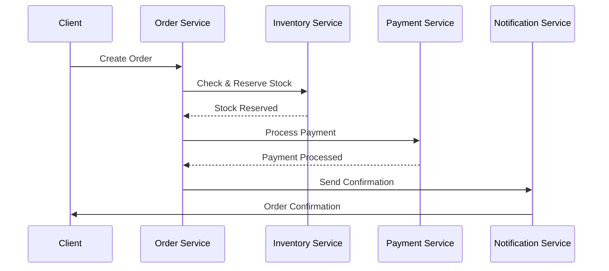

# Distributed Commerce System

A microservices-based e-commerce system demonstrating distributed transaction patterns using RabbitMQ.

## System Architecture

The system consists of four main services:
- **Order Orchestration** (FastAPI): Handles order creation and orchestrates the order flow
- **Inventory Management** (Django): Manages product inventory and reservations
- **Payment Gateway** (Spring Boot): Processes payments and handles financial transactions
- **Notification Engine** (Node.js): Manages all system notifications

## Message Flow

1. Order Creation Flow:


## Setup and Installation

1. Start the infrastructure:
```bash
cd docker
docker-compose up -d
```

2. Access RabbitMQ Management UI:
- URL: http://localhost:15672
- Username: admin
- Password: admin123

3. Service URLs:
- Order Service: http://localhost:8000
- Inventory Service: http://localhost:8001
- Payment Service: http://localhost:8002
- Notification Service: http://localhost:8003

## Development

Each service has its own setup instructions in its respective directory:
- [Order Service Setup](./order-orchestration/README.md)
- [Inventory Service Setup](./inventory-management/README.md)
- [Payment Service Setup](./payment-gateway/README.md)
- [Notification Service Setup](./notification-engine/README.md)

## RabbitMQ Exchange Structure

The system uses several exchanges:
- `order.exchange` (topic): Order-related events
- `inventory.exchange` (direct): Inventory updates
- `payment.exchange` (direct): Payment processing
- `notification.exchange` (fanout): System notifications
